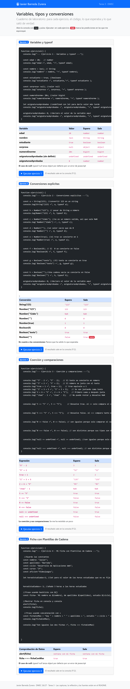
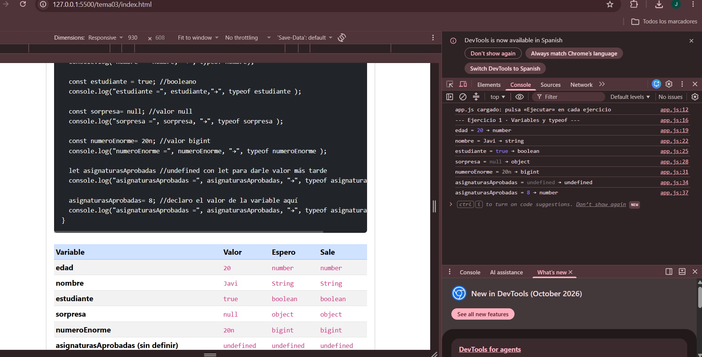
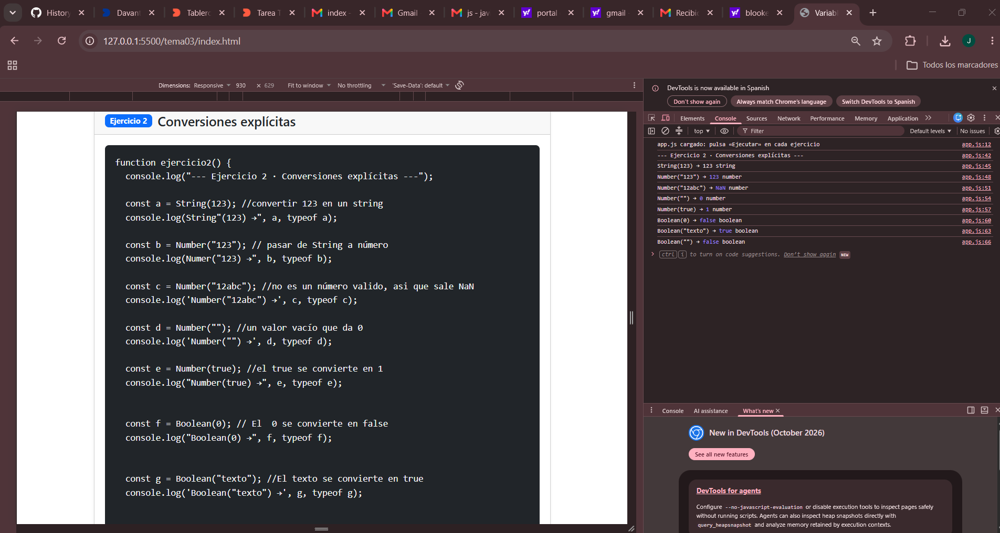
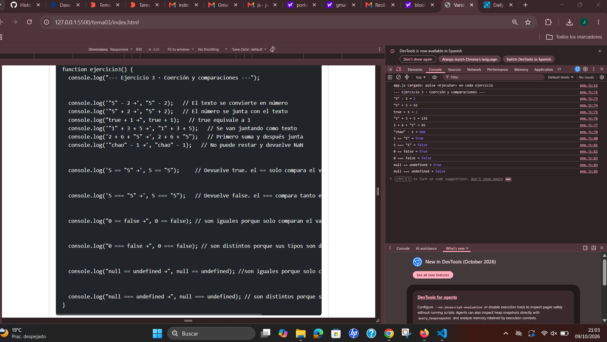
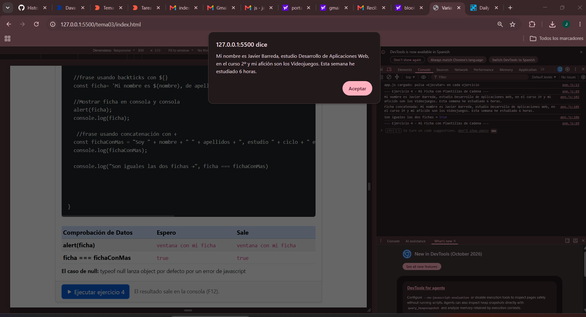

# Tarea 3 · Variables, tipos y conversiones

**Autor:** Javier Barreda Zurera · Desarrollo Web en Entorno Cliente (DWEC) · 2.º DAW · Curso 2026-27

En esta tarea he practicado los tipos de datos, las conversiones explícitas, la coerción y las comparaciones en JavaScript. La página reúne los cuatro ejercicios y sus resultados. Para probarlos, abre `index.html` con Live Server, abre las herramientas de desarrollo con F12 y pulsa el botón de cada ejercicio.

## Capturas

### a) Página completa

La captura muestra las cuatro tarjetas de ejercicios y las tablas con las predicciones y resultados.

### b) Consola del ejercicio 1

Se muestran los valores y tipos de las variables, incluido `undefined` antes de asignarle un valor.

### c) Consola del ejercicio 2

Se ven los resultados de las conversiones con `String`, `Number` y `Boolean`.

### d) Consola del ejercicio 3

La consola muestra los resultados de las operaciones con distintos tipos y las comparaciones con `==` y `===`.

### e) Ejercicio 4

La captura muestra la ficha en una ventana emergente y, en la consola, las dos versiones de la ficha y la comparación entre ellas.

## Reflexión

- Con este trabajo he practicado cómo declarar variables con `const` y `let` y consultar su tipo con `typeof`.
- Me resultó intuitivo que `Number("123")` convierta el texto `"123"` en el número `123`.
- También comprobé que `Number("")` devuelve `0`, aunque la cadena no contenga ningún dígito.
- Me sorprendió que `typeof null` devuelva `"object"`; es un comportamiento histórico de JavaScript.
- Con `Boolean(0)` obtuve `false`, mientras que una cadena con contenido como `"texto"` se convierte en `true`.
- La cadena vacía también da `false`, por eso revisé la predicción marcada como incorrecta en la tabla.
- Entendí que el operador `+` puede concatenar: por ejemplo, `"5" + 2` da `"52"`.
- En cambio, el operador `-` convierte los operandos a números, como ocurre en `"5" - 2`, que da `3`.
- El ejercicio 3 me pareció el más difícil porque tuve que distinguir cuándo JavaScript concatena cadenas y cuándo convierte los valores a números.
- También me costó entender las diferencias entre `==` y `===`, especialmente al comparar `null` con `undefined`.
- Por último, comparar la ficha con plantilla y la concatenada me ayudó a comprobar que ambas construyen el mismo texto.

## Fuentes

- [MDN: Tipos de datos y estructuras en JavaScript](https://developer.mozilla.org/es/docs/Web/JavaScript/Guide/Data_structures)
- [MDN: Conversión de tipos](https://developer.mozilla.org/es/docs/Glossary/Type_coercion)
- [MDN: Igualdad estricta](https://developer.mozilla.org/es/docs/Web/JavaScript/Reference/Operators/Strict_equality)
- [MDN: Plantillas de cadena](https://developer.mozilla.org/es/docs/Web/JavaScript/Reference/Template_literals)

## Uso de IA

He utilizado  como apoyo para revisar la estructura del readme, pasar todo a markdown y ayuda con la estructura del ejercicio 3 ya que me he quedado un poco atascado.
